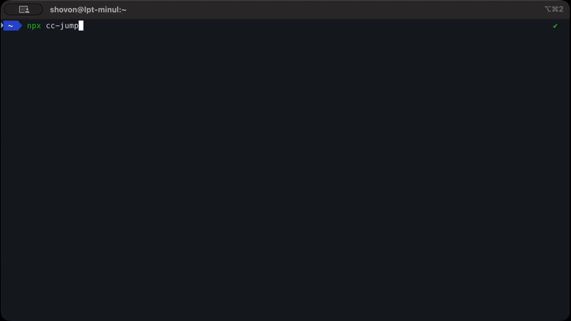

<h1 align="center">cc-jump</h1>

<p align="center">
  Browse and resume your <a href="https://claude.com/claude-code">Claude Code</a> sessions, organized by the project they belong to.
</p>

<p align="center">
  <a href="https://www.npmjs.com/package/cc-jump"></a>
  <a href="./LICENSE"></a>
  
</p>

<p align="center"></p>

```bash
npx cc-jump
```

No install, no config. Run that one command from anywhere.

## The problem

Claude Code's `/resume` only shows sessions from the directory you're in, in one flat list. If you work across several projects, there's no way to see them all and jump into the one you want.

`cc-jump` groups your sessions by project folder and lets you drill down to the one you want:

```
npx cc-jump
  → projects/ → personal/ → cc-jump   (drill down a level at a time)
  → pick a session (shown with its title and timestamp)
  → you're back in Claude Code, in the right directory
```

Single-child folders are skipped so every menu is a real choice, and `← Back` steps up a level.

## How it works

Claude Code stores each session as a `.jsonl` transcript under `~/.claude/projects/`. `cc-jump` reads those, groups them into the folder tree your projects live in, and resumes the one you pick by running `claude --resume` in its directory.

It works out each project's real path by reading the working directory recorded inside the transcript (the folder names Claude Code uses aren't reliable to decode). For a session's label it uses the title Claude Code generated, or your first message as a fallback. It only reads your data — it never changes anything.

## Requirements

- **Node.js 18 or newer.**
- **The `claude` CLI** on your `PATH` (`npm install -g @anthropic-ai/claude-code`). `cc-jump` checks and tells you if it's missing.

## Contributing

I built this for myself, but if it helps you too, that's the point. The code is kept small and readable on purpose, so it's easy to pick up — see [CONTRIBUTING.md](./CONTRIBUTING.md).

## Similar tools

`cc-jump` does one thing: the simplest directory-first way to resume a session from a single `npx` command. If you want more — analytics, exporting, reading transcripts — these do that: **cc-sessions**, **ccrider**, **claude-sessions-cli**, **claude-code-viewer**.

## License

[MIT](./LICENSE) © ShovonCodes
